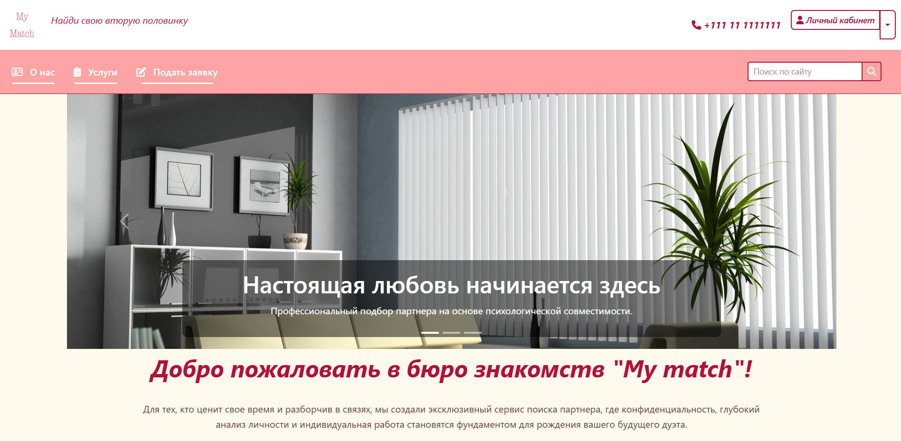
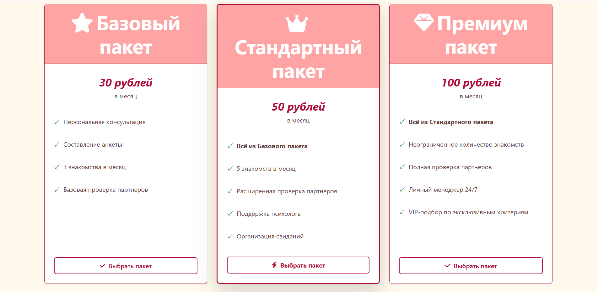

# My Match – Бюро знакомств

Современный, адаптивный сайт для брачного агентства "My Match". Этот проект создан в учебных целях для отработки навыков фронтенд‑разработки с использованием HTML5, Sass и Bootstrap 5. Основной упор сделан на техническую реализацию: семантическую вёрстку, архитектуру Sass, адаптивность и использование готовых компонентов.

***Примечание:*** Дизайн не был приоритетом. Основная цель заключалась в демонстрации владения технологиями, поэтому визуальное оформление может быть простым или вдохновлено типовыми макетами.*

Английская версия доступна [здесь](README.md).

## Описание
Этот многостраничный сайт представляет бренд, ценности и услуги брачного агентства. Он включает главную страницу с каруселью и статистикой, страницу "О нас" с карточками команды и описанием методологии, страницу "Услуги" с карточками тарифов, а также форму для заявки. Проект демонстрирует семантическую вёрстку HTML, кастомные стили Sass и компоненты Bootstrap.

## Используемые технологии
- **HTML5** – семантическая вёрстка
- **CSS3 / Sass** – модульные стили с переменными, примесями (mixins) и вложенностью
- **Bootstrap 5** – адаптивная сетка, навбар, карусель, карточки, формы
- **Font Awesome 6** – иконки

## Возможности
- Полностью адаптивная вёрстка (мобильные устройства, планшеты, десктопы)
- Главная страница с каруселью изображений, приветственным блоком и боковой панелью со статистикой
- Страница "О нас" с информацией о ценностях компании, карточками команды и уникальной методологией
- Страница "Услуги" с тремя тарифными планами и интерактивными эффектами при наведении
- Страница "Подать заявку" с валидируемой HTML5-формой
- Единые шапка с навигацией и подвал для всех страниц
- Индивидуальная цветовая схема (#b1103a, #ffa4a4, #fffaed)
- Плавные анимации и переходы для интерактивных элементов

## Скриншоты
Главная страница с каруселью и приветственным блоком

 

Страница "Услуги" с карточками тарифов

## Установка и использование

### Требования
- Любой современный веб-браузер.
- Опционально: Компилятор Sass, если вы хотите изменять стили.

### Шаги
1. Клонируйте репозиторий:

  `git clone https://github.com/yourusername/my-match.git`

  Откройте любой .html файл в браузере (например, index.html).

2. Для кастомизации стилей Sass:

  `npm install -g sass`

  `sass --watch scss/main.scss css/main.css`

### Автор
Дарья – [GitHub](https://github.com/ddeeduck), [Telegram](https://t.me/deeduck), [LinkedIn](www.linkedin.com/in/deeduck), Email: dehterevich.daria@gmail.com

### Лицензия
Этот проект лицензирован по лицензии MIT – подробности см. в файле LICENSE.
